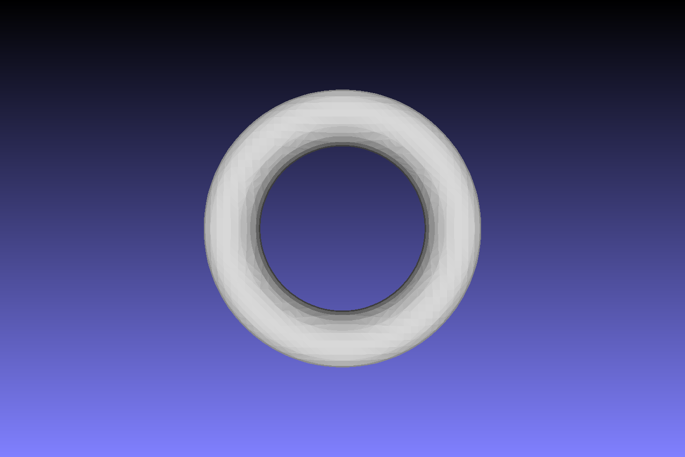
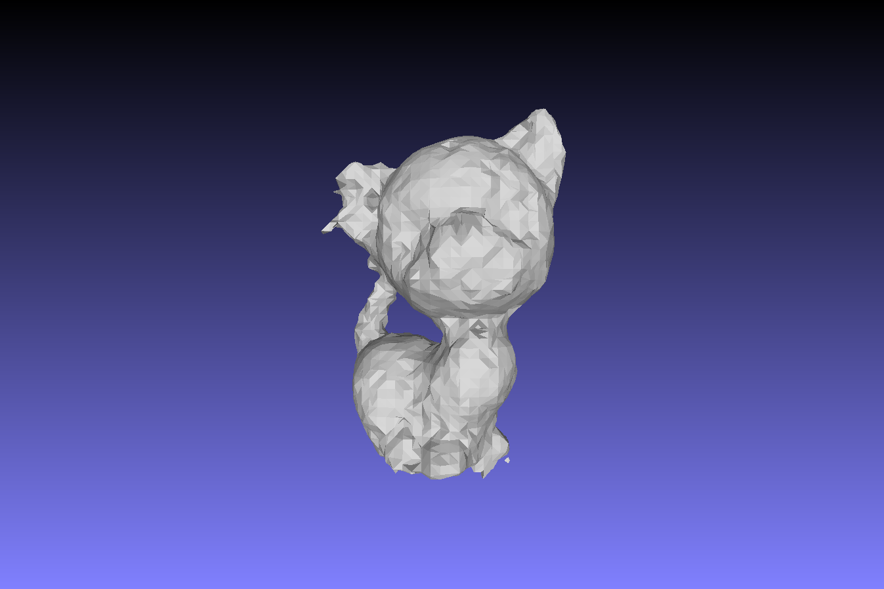

# TUM IN2354 – 3D Scanning and Motion Capture (Exercises)

This repository contains all programming exercises for the course **IN2354 – 3D Scanning and Motion Capture** at TUM.  
It includes implementations for mesh generation, surface reconstruction, and volumetric methods.

---

## Directory Structure

IN2354/
├── Exercise-1/ # RGB-D mesh reconstruction (TUM dataset)
├── Exercise-2/ # Surface reconstruction (Sphere, Torus, Hoppe, RBF)
├── Libs/ # External libraries (e.g., Eigen, FreeImage)
├── Data/ # Input datasets (e.g., TUM RGB-D, point clouds)
├── media/ # Screenshots used in this README (for visualization only)
└── .gitignore


## Build Instructions

```bash
cd Exercise-X
mkdir build && cd build
cmake ..
cmake --build .
Modify main.cpp to switch between tasks if applicable.
```

##  Visual Results 
### Exercise 2
| Method | Visualization           |
| ------ | ----------------------- |
| Sphere |  |
| Torus  |   |
| Hoppe  |   |
| RBF    |     |
